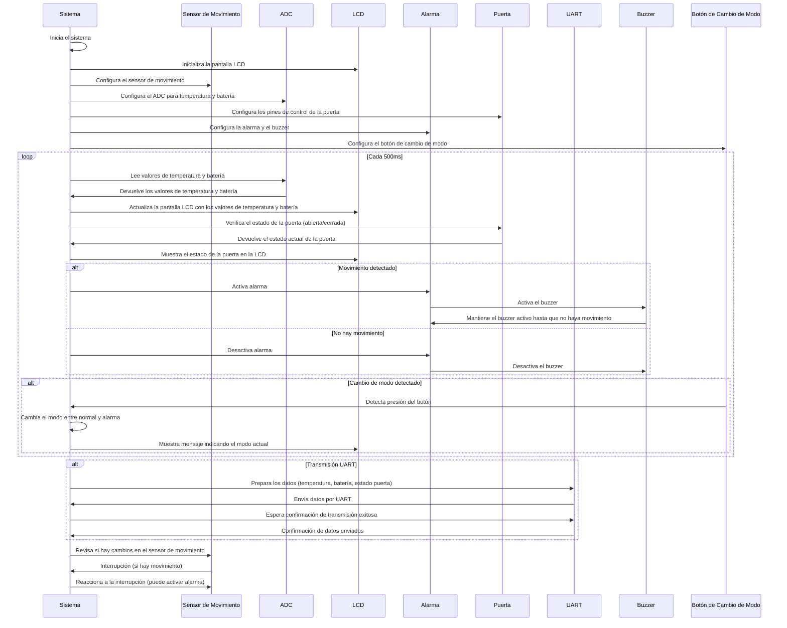

# Lenox-Legends

En este repositorio se encuentran los archivos del proyecto utilizando 
la placa STM32 - BluePill con y sin FreeRTOS.

Se implemento la actividad propuesta por el profesor.

## Integrantes del Grupo:
1. Lenox Graham
2. Franco Mamaní
3. Mauricio Mugni

## Esquemático del circuito final

## Diagrama de flujos para el código sin FreeRTOS

## Diagrama de secuencias para el código con FreeRTOS

## Imagen del circuito 

