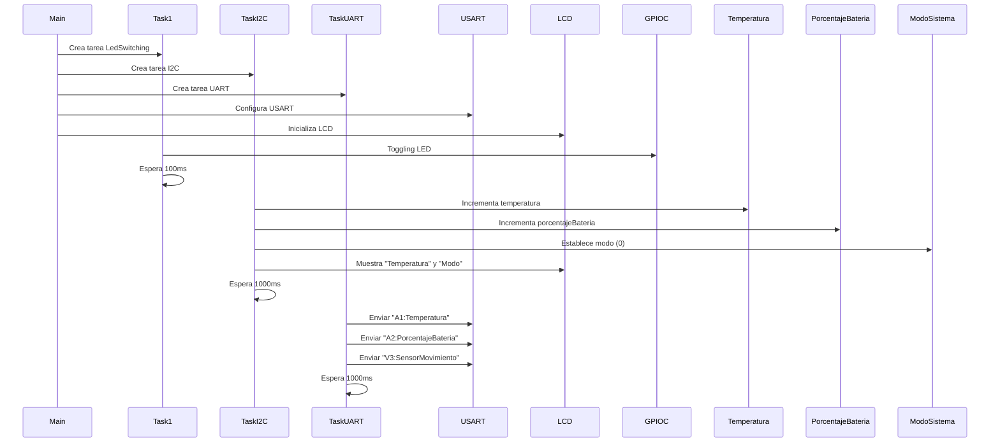

```mermaid
sequenceDiagram
    participant Main
    participant Task1
    participant TaskI2C
    participant TaskUART
    participant USART
    participant LCD

    Main->>Task1: Crea tarea LedSwitching
    Main->>TaskI2C: Crea tarea I2C
    Main->>TaskUART: Crea tarea UART
    Main->>USART: Configura USART
    Main->>LCD: Inicializa LCD

    Task1->>GPIOC: Toggling LED
    Task1->>Task1: Espera 100ms

    TaskI2C->>Temperatura: Incrementa temperatura
    TaskI2C->>PorcentajeBateria: Incrementa porcentajeBateria
    TaskI2C->>ModoSistema: Establece modo (0)
    TaskI2C->>LCD: Muestra "Temperatura" y "Modo"
    TaskI2C->>TaskI2C: Espera 1000ms

    TaskUART->>USART: Enviar "A1:Temperatura"
    TaskUART->>USART: Enviar "A2:PorcentajeBateria"
    TaskUART->>USART: Enviar "V3:SensorMovimiento"
    TaskUART->>TaskUART: Espera 1000ms
```
